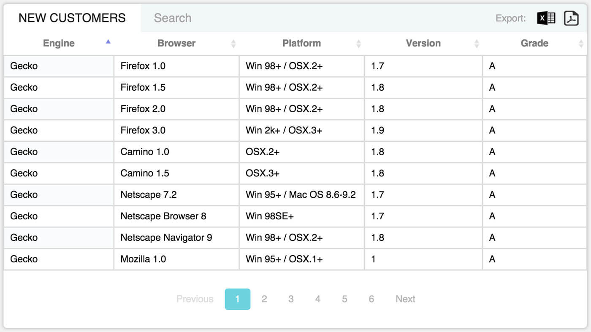

tcg-data-table
============
A DataTable Element for client side and server side data. Built on top of DataTables jQuery plugin for Polymer 0.5.



## How to use
###Include the element in your page
```
<link rel="import" href="/bower_components/tcg-data-table/tcg-data-table.html">
```

###Then use the element in your page

```
<tcg-data-table 
	name="Title of Table Data" 
	data="{{ data }}" 
	columns="{{ columns }}"></tcg-data-table>
```

###Other attributes you may include in the table

```
<tcg-data-table 
	name="Title of Table Data" 
	data="{{ data }}" 
	columns="{{ columns }}" 
	perPage="{{ per_page }}" 
	page="{{ page }}" 
	total="{{ total }}" 
	paginationResults="{{ paginationResults }}"></tcg-data-table>

```

####Note: by adding 'page' attribute you are saying that the element is going to retrieve data via server side

Learn more about how to organize the data at http://www.datatables.net
